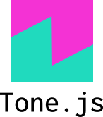

<h1 align="center"> Hey! Thanks for stopping by </h1>

<h2> I'm Koz, a fullstack software engineer on a mission to make the web that little bit more fun</h2>

To me nothing is more motivating than designing an immaginative solution to a problem and nothing is more rewarding than seeing it through to the end.
I am fiercely collaborative and a voracious consumer of music and coffee.

- 💻 I’m currently making my web sequencer into a web based mini-DAW
- 🌱 I’m currently learning Typescript and web animation with GSAP and Three.js
- 💬 Ask me about Web Sockets and the Web Audio API
- 📫 How to reach me: kgrachev@gmail.com

- ⚡ Fun fact: I'm learning to play the Jew's harp

  
  
  
  
  
  
  
  
  
  
  
  
  
  
  

  
<b> 👀 Check out my Stats</b>

 

 

<!-- 
 -->

